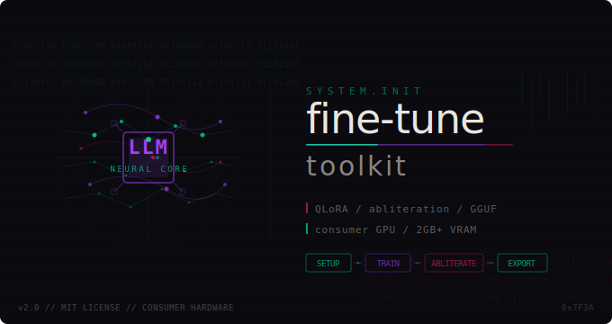

# 🧠 LLM Fine-tuning Toolkit

<p align="center">
  
</p>

A config-driven toolkit for fine-tuning small language models (135M–3.8B parameters) using QLoRA, with a real-time training dashboard, interactive chat interface, automated benchmarking with historical scoring, abliteration (refusal removal), and one-command export to Ollama.

Built for running on consumer hardware — including GPUs with as little as 2GB VRAM.

> ⚡ Weekend project, vibe coded with [Claude](https://claude.ai). Built in a couple of sessions to scratch an itch — wanted to fine-tune small models without wrestling with boilerplate every time.


---

## Screenshots

### Training Dashboard

Real-time TUI showing loss, GPU/CPU/RAM usage, and training progress.


### Validation

Pre-flight checks catch bad configs and show token distributions before you commit GPU time.

### Chat Interface

Interactive streaming chat with model switching between base and fine-tuned.


---

## Features

* **Setup wizard** — detects your GPU, recommends a model and datasets, generates a safe `config.yaml` in seconds
* **Config-driven** — edit `config.yaml` to swap models, datasets, and hyperparameters without touching code
* **20 supported models** — Qwen 2.5/3.5, IBM Granite 4.0, Phi-3.5, Gemma 3, Llama 3.2, SmolLM2/3 with auto-detected LoRA targets
* **Custom model support** — use any HuggingFace causal LM, not just the presets
* **Dataset presets** — general assistant, conversational, instruction-following, code, or bring your own HuggingFace datasets
* **Low VRAM friendly** — 4-bit quantization (QLoRA) trains 135M–3.8B models on GPUs with as little as 1GB VRAM
* **Real-time dashboard** — live TUI showing loss, GPU/CPU/RAM usage, and training progress
* **OOM recovery** — crashes show exactly what to change in config instead of raw tracebacks
* **GPU cleanup** — auto-detects stale GPU processes and offers to kill them on startup
* **Graceful Ctrl+C** — interrupt training or generation without losing progress
* **Validation before training** — catches bad configs, shows token distributions, and estimates VRAM usage
* **Eval split tracking** — monitors validation loss to detect overfitting
* **Benchmark scoring** — composite 0-100 score with historical tracking to measure improvement over time
* **Streaming chat** — interactive terminal chat with model switching, history, and help command
* **Abliteration** — remove refusal behavior from any model without retraining, using weight orthogonalization
* **Merge & export** — produce standalone models for deployment or HuggingFace Hub upload
* **Ollama export** — one-command conversion to GGUF with auto-generated Modelfile and Ollama registration
* **Cleanup tool** — selectively remove trained models, HuggingFace cache, and artifacts to free disk space

## Project Structure

```
llm-finetune-toolkit/
├── setup.py           # Interactive setup wizard — run this first
├── config.yaml        # All hyperparameters and settings — edit this, not the code
├── utils.py           # Shared utilities (config, model loading, data formatting, GPU cleanup)
├── finetune.py        # Training script with QLoRA, live dashboard, and eval tracking
├── chat.py            # Interactive streaming chat (base / finetuned / merged / abliterated)
├── validate.py        # Pre-flight checks: config validation, data stats, memory estimates
├── benchmark.py       # Scored benchmarking with historical tracking
├── merge.py           # Merge LoRA adapters into standalone model for deployment
├── abliterate.py      # Remove refusal behavior using weight orthogonalization
├── export.py          # Convert to GGUF and register with Ollama
├── cleanup.py         # Remove trained models, caches, and artifacts
├── requirements.txt   # Python dependencies
└── README.md
```

## Quick Start

### 1. Install

```bash
git clone https://github.com/finnmagnuskverndalen/llm-finetune-toolkit.git
cd llm-finetune-toolkit
python3 -m venv venv
source venv/bin/activate
pip install -r requirements.txt
```

### 2. Setup

```bash
python3 setup.py
```

The wizard detects your GPU, shows compatible models with descriptions, lets you pick a dataset preset (or add your own), and generates a `config.yaml` tuned for your hardware. No more OOM guessing.

For a fully automatic setup with no questions:

```bash
python3 setup.py --auto
```

**Supported models (20 presets + custom):**

| Model | Params | Min VRAM | License | Description |
| --- | --- | --- | --- | --- |
| HuggingFaceTB/SmolLM2-135M-Instruct | 135M | ~0.5 GB | Apache 2.0 | Smallest practical instruct model. 2T tokens training. |
| ibm-granite/granite-4.0-350m | 350M | ~0.5 GB | Apache 2.0 | IBM Granite Nano. Native tool calling, RAG, FIM code. ISO 42001. |
| HuggingFaceTB/SmolLM2-360M-Instruct | 360M | ~1 GB | Apache 2.0 | HuggingFace's own. 4T tokens. Function calling support. |
| Qwen/Qwen2.5-0.5B-Instruct | 0.5B | ~1.5 GB | Apache 2.0 | Best overall sub-1B. 128K context, 29 languages. |
| Qwen/Qwen2.5-Coder-0.5B-Instruct | 0.5B | ~1.5 GB | Apache 2.0 | Best tiny coding model. Purpose-built for code. |
| Qwen/Qwen2-0.5B-Instruct | 0.5B | ~1.5 GB | Apache 2.0 | Predecessor to 2.5. 37.9% MMLU, 40.1% GSM8K. |
| Qwen/Qwen3.5-0.8B | 0.8B | ~1.5 GB | Apache 2.0 | Newest tiny multimodal. 256K context, 201 languages. |
| google/gemma-3-1b-it | 1B | ~1.5 GB | Gemma | Google edge champion. 2585 tok/s prefill on mobile GPU. |
| ibm-granite/granite-4.0-1b | 1B | ~1.5 GB | Apache 2.0 | IBM Granite Nano dense. Tool calling, RAG, FIM code. |
| ibm-granite/granite-4.0-h-1b | 1.5B | ~1.5 GB | Apache 2.0 | IBM Granite hybrid Mamba-2/Transformer. ISO 42001 certified. |
| meta-llama/Llama-3.2-1B-Instruct | 1B | ~2 GB | Llama 3.2 | Meta's smallest Llama. 128K context, largest fine-tune ecosystem. |
| TinyLlama/TinyLlama-1.1B-Chat-v1.0 | 1.1B | ~2 GB | Apache 2.0 | Classic small LLM. 3T tokens. Huge community of fine-tunes. |
| HuggingFaceTB/SmolLM2-1.7B-Instruct | 1.7B | ~2.5 GB | Apache 2.0 | Largest SmolLM2. 11T tokens training. |
| Qwen/Qwen2.5-1.5B-Instruct | 1.5B | ~3 GB | Apache 2.0 | Competitive with many 7B models from 2023. |
| ibm-granite/granite-4.0-micro | 3B | ~3 GB | Apache 2.0 | IBM Granite Micro. Enterprise tool calling + instruction following. |
| google/gemma-2-2b-it | 2B | ~3 GB | Gemma | Google's efficient 2B. Clean, well-documented, good safety tuning. |
| Qwen/Qwen2.5-3B-Instruct | 3B | ~5 GB | Apache 2.0 | Best in the 3B class. 128K context, 29 languages, strong reasoning. |
| meta-llama/Llama-3.2-3B-Instruct | 3B | ~5 GB | Llama 3.2 | Meta's 3B Llama. Broadest tool support. |
| HuggingFaceTB/SmolLM3-3B-Instruct | 3B | ~5 GB | Apache 2.0 | HuggingFace latest. Outperforms Llama-3.2-3B. Dual-mode thinking. |
| microsoft/Phi-3.5-mini-instruct | 3.8B | ~6 GB | MIT | Microsoft reasoning champion. 128K context. Beats many 6-9B models. |

Or enter `0` during setup to use any HuggingFace model ID.

**Dataset presets:**

| Preset | Description |
| --- | --- |
| General assistant | OpenAssistant + Alpaca — broad conversational and instruction-following |
| Conversational | OpenAssistant only — multi-turn chat focused |
| Instruction following | Alpaca only — single-turn instruction/response pairs |
| Code | Code Alpaca — coding instruction/response pairs |
| Code + general | Code Alpaca + OpenAssistant — coding with general chat skills |
| Custom | Enter your own HuggingFace dataset IDs |

### 3. Validate

```bash
python3 validate.py
```

Checks your config, loads datasets, shows token length distributions, and flags problems before you commit GPU time.

### 4. Train

```bash
python3 finetune.py
```

The live dashboard shows training progress, loss, eval metrics, and system resource usage in real time. If you hit Ctrl+C, checkpoints are preserved. If you run out of memory, it tells you exactly what to change.

### 5. Chat

```bash
python3 chat.py              # Fine-tuned model
python3 chat.py --base       # Base model for comparison
python3 chat.py --merged     # Merged model (after running merge.py)
python3 chat.py --abliterated # Abliterated model (after running abliterate.py)
```

Commands during chat: `switch` to toggle models, `reset` to clear history, `help` for all commands, `status` for GPU/RAM info. Press Ctrl+C during generation to stop it without crashing.

### 6. Benchmark

Run a benchmark and tag it with a description:

```bash
python3 benchmark.py --tag "50 steps lr=2e-5"
```

Each run produces a composite score (0-100) graded A+ through F, broken down into five components:

| Component | Max Points | What it measures |
| --- | --- | --- |
| Perplexity | 35 | Confidence improvement over base model |
| Coherence | 25 | Low repetition in responses |
| Response quality | 20 | Length, structure, vocabulary richness |
| Speed | 10 | Tokens/sec compared to base |
| Consistency | 10 | Even performance across all categories |

After training more, benchmark again to track progress:

```bash
python3 benchmark.py --tag "200 steps lr=2e-5"
python3 benchmark.py --tag "500 steps lr=1e-5"
```

View your score history and trends over time:

```bash
python3 benchmark.py --history
```

Example output:

```
#   Date              Score   Grade   Trend      Tag                Config
1   2026-03-15 15:30  42.3    C       —          50 steps lr=2e-5   steps=50 lr=2e-05 r=16
2   2026-03-15 16:45  58.7    C+      +16.4 ↑    200 steps lr=2e-5  steps=200 lr=2e-05 r=16
3   2026-03-15 18:00  71.2    B+      +12.5 ↑    500 steps lr=1e-5  steps=500 lr=1e-05 r=16
```

### 7. Merge

```bash
python3 merge.py                          # Merge LoRA adapters into standalone model
python3 merge.py --push username/my-model # Push to HuggingFace Hub
```

### 8. Abliterate (optional)

Remove refusal behavior from any model using [abliteration](https://huggingface.co/blog/mlabonne/abliteration) — identifies and removes the "refusal direction" in model weights without retraining. Uses techniques from community research ([grimjim](https://huggingface.co/blog/grimjim/norm-preserving-biprojected-abliteration), [huihui-ai](https://huggingface.co/huihui-ai/Qwen2.5-0.5B-Instruct-abliterated-v3), [Heretic](https://github.com/p-e-w/heretic)) proven to work on small models (0.5B+).

```bash
python3 abliterate.py                # Abliterate merged model (or base if no merged exists)
python3 abliterate.py --base         # Abliterate base model directly (skip fine-tuning)
python3 abliterate.py --scale 2.0    # Stronger removal (default: 1.5, try 2.0-3.0 for stubborn models)
python3 abliterate.py --dry-run      # Preview without saving
```

**No fine-tuning required.** You can go straight from `setup.py` to `abliterate.py` to uncensor a base model:

```bash
python3 setup.py                     # Pick a model
python3 abliterate.py --base         # Download and abliterate it
python3 chat.py --merged             # Chat with the abliterated model
python3 export.py                    # Export to Ollama
```

If a merged model exists (from fine-tuning), it uses that by default. If not, it asks whether to abliterate the base model directly.

**How it works:**

1. Collects hidden state activations on harmful + harmless prompt datasets
2. Finds the single best "refusal direction" from middle-to-late layers
3. Applies that direction across a range of layers with a scale factor
4. Auto-retries with different scales if the first attempt makes things worse
5. Shows before/after refusal comparison on 8 test prompts

**Key techniques for small models:**

* **Scale factor** (`--scale 1.5`): amplifies refusal removal. Standard abliteration (1.0) is too weak for small models. Try 2.0–3.0 for stubborn refusals.
* **Single direction**: uses ONE direction from the best layer applied everywhere, not per-layer directions that cancel each other out.
* **Layer range**: only modifies layers 30%–85% of model depth, preserving language coherence in early and late layers.

Choose harmful datasets in the setup wizard or in `config.yaml`:

```yaml
abliteration:
  enabled: true
  harmful_dataset: "allenai/wildjailbreak"    # 262K prompts (best), or "JailbreakBench/JBB-Behaviors" (fast)
  harmless_dataset: "mlabonne/harmless_alpaca"
  n_samples: 256          # More = sharper signal. Reduce to 64 for <=2GB VRAM
  batch_size: 2            # Reduce to 1 for <=2GB VRAM
```

### 9. Export to Ollama

```bash
python3 export.py                          # Default: Q8_0 quantization + Ollama registration
python3 export.py --quantize q4_k_m        # Smaller, faster (4-bit)
python3 export.py --name my-assistant      # Custom Ollama model name
python3 export.py --list-quantizations     # Show all quantization options
```

Then run your fine-tuned model locally:

```bash
ollama run qwen2.5-0.5b-instruct-finetuned
```

**Prerequisites for Ollama export:**

```bash
git clone https://github.com/ggml-org/llama.cpp.git
pip3 install -r llama.cpp/requirements.txt --break-system-packages
curl -fsSL https://ollama.com/install.sh | sh
```

**Available quantization levels:**

| Type | Description |
| --- | --- |
| f16 | 16-bit float — large, near-original quality |
| q8_0 | 8-bit — good balance of quality and size (default) |
| q6_k | 6-bit — slightly smaller, minimal quality loss |
| q5_k_m | 5-bit — smaller, good quality for most use cases |
| q4_k_m | 4-bit — small and fast, some quality loss |
| q4_0 | 4-bit — smallest practical, more quality loss |
| q3_k_m | 3-bit — very small, noticeable quality loss |
| q2_k | 2-bit — tiny, significant quality loss |

### 10. Cleanup

Remove trained models, HuggingFace cache, and artifacts to free disk space:

```bash
python3 cleanup.py              # Interactive — choose what to remove
python3 cleanup.py --all        # Remove everything (no prompts)
python3 cleanup.py --models     # Only trained/merged/exported models
python3 cleanup.py --cache      # Only HuggingFace model + dataset caches
python3 cleanup.py --artifacts  # Only benchmark history, checkpoints, backups
python3 cleanup.py --dry-run    # Preview what would be deleted
```

Shows a table of everything found with sizes before you confirm deletion.

## Configuration

Everything is controlled through `config.yaml`. Run `python3 setup.py` to generate one automatically, or edit manually.

### Training

```yaml
training:
  max_steps: -1              # Set to a number to override epochs (e.g., 50 for testing)
  num_epochs: 2
  batch_size: 1              # Lower = less VRAM
  gradient_accumulation_steps: 16
  learning_rate: 2.0e-5
  max_grad_norm: 0.3
  neftune_noise_alpha: 5.0
```

### Datasets

```yaml
datasets:
  - name: "timdettmers/openassistant-guanaco"
    split: "train"
    max_samples: 2500
  - name: "yahma/alpaca-cleaned"
    split: "train"
    max_samples: 2500
```

Auto-detects format (Guanaco multi-turn, Alpaca instruction/output, or native messages). Add any HuggingFace dataset — just follow one of these formats.

### Data Filtering

```yaml
data:
  max_length: 512            # Max sequence length in tokens (reduce for low VRAM)
  max_assistant_chars: 1500  # Filter out overly long responses
  min_assistant_chars: 20    # Filter out trivially short responses
  eval_split: 0.05           # 5% held out for validation
```

## VRAM Troubleshooting

If you hit `CUDA out of memory` errors, the toolkit now shows specific fix suggestions. You can also re-run the setup wizard:

```bash
python3 setup.py
```

Or manually in `config.yaml`:

1. **Reduce `batch_size`** to `1`
2. **Reduce `max_length`** — try `256` for 2GB GPUs
3. **Kill GPU processes** — the toolkit auto-detects these on startup
4. **Try a smaller vocab model** — SmolLM (49K vocab) or Phi-3.5 (32K vocab) vs Qwen (151K vocab)

## Why Fine-tuned Models Get "Dumber"

| Mistake | Effect | Fix in this toolkit |
| --- | --- | --- |
| Learning rate too high (1e-4) | Erases base model knowledge | Default: 2e-5 |
| No gradient clipping | Catastrophic weight updates | Default: max_grad_norm=0.3 |
| Sequence length too short (256) | Model can't learn real answers | Default: 512–1024 |
| Aggressive data filtering | Discards all quality examples | Relaxed to 1500 chars |
| No eval split | Can't detect overfitting | Default: 5% eval split |
| Low LoRA rank | Not enough capacity to learn | Default: r=16, alpha=32 |
| dtype mismatch train/inference | Inconsistent behavior | Auto-matched in both scripts |

## Workflow

```
setup.py  →  validate.py  →  finetune.py  →  benchmark.py  →  merge.py  →  export.py
                 ↑                ↓               ↓                            ↓
                 │            chat.py        --history                   ollama run
                 └──────── adjust config.yaml ─────────────────────────────────┘
```

## Requirements

* Python 3.10+
* NVIDIA GPU with CUDA support (1GB+ VRAM) or CPU (slower)
* ~8GB RAM minimum
* [Ollama](https://ollama.com) (optional, for local deployment)
* [llama.cpp](https://github.com/ggml-org/llama.cpp) (optional, for GGUF conversion)

## License

MIT

## Contributing

PRs welcome. If you fine-tune a model that works well on a specific task, consider sharing your `config.yaml` and dataset setup.