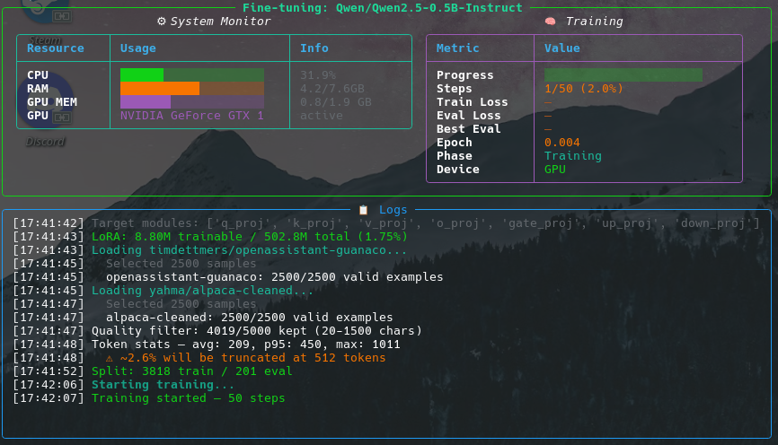
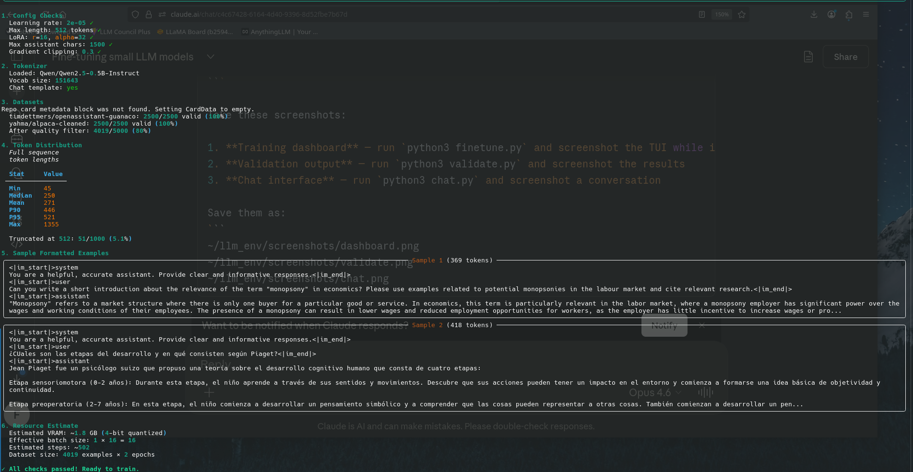
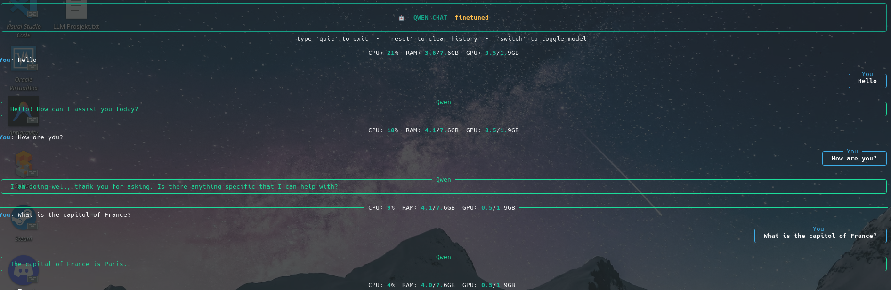

# 🧠 LLM Fine-tuning Toolkit

A config-driven toolkit for fine-tuning small language models (0.5B–3B parameters) using QLoRA, with a real-time training dashboard, interactive chat interface, and automated benchmarking.

Built for running on consumer hardware — including GPUs with as little as 2GB VRAM.

> ⚡ Weekend project, vibe coded with [Claude](https://claude.ai). Built in a couple of sessions to scratch an itch — wanted to fine-tune small models without wrestling with boilerplate every time.


---

## Screenshots

### Training Dashboard
Real-time TUI showing loss, GPU/CPU/RAM usage, and training progress.



### Validation
Pre-flight checks catch bad configs and show token distributions before you commit GPU time.



### Chat Interface
Interactive streaming chat with model switching between base and fine-tuned.



---

## Features

- **Config-driven** — edit `config.yaml` to swap models, datasets, and hyperparameters without touching code
- **Multi-model support** — Qwen 2.5, Phi-3.5, Gemma 2, Llama 3.2, SmolLM2 with auto-detected LoRA targets
- **Low VRAM friendly** — 4-bit quantization (QLoRA) trains 0.5B models on a 2GB GPU
- **Real-time dashboard** — live TUI showing loss curves, GPU/CPU/RAM usage, and training progress
- **Validation before training** — catches bad configs, shows token distributions, and estimates VRAM usage
- **Eval split tracking** — monitors validation loss to detect overfitting
- **Benchmarking** — automated side-by-side comparison of base vs fine-tuned model with perplexity, speed, and repetition metrics
- **Streaming chat** — interactive terminal chat with model switching, history management, and system monitoring
- **Merge & export** — produce standalone models for deployment or HuggingFace Hub upload

## Project Structure
```
llm-finetune-toolkit/
├── config.yaml        # All hyperparameters and settings — edit this, not the code
├── finetune.py        # Training script with QLoRA, live dashboard, and eval tracking
├── chat.py            # Interactive streaming chat (base / finetuned / merged modes)
├── validate.py        # Pre-flight checks: config validation, data stats, memory estimates
├── benchmark.py       # Automated base vs fine-tuned comparison with metrics
├── merge.py           # Merge LoRA adapters into standalone model for deployment
├── requirements.txt   # Python dependencies
└── README.md
```

## Quick Start

### 1. Install
```bash
git clone https://github.com/finnmagnuskverndalen/llm-finetune-toolkit.git
cd llm-finetune-toolkit
python3 -m venv venv
source venv/bin/activate
pip install -r requirements.txt
```

### 2. Validate
```bash
python3 validate.py
```

Checks your config, loads datasets, shows token length distributions, and flags problems before you commit GPU time.

### 3. Train
```bash
python3 finetune.py
```

The live dashboard shows training progress, loss, eval metrics, and system resource usage in real time.

### 4. Chat
```bash
python3 chat.py              # Fine-tuned model
python3 chat.py --base       # Base model for comparison
python3 chat.py --merged     # Merged model (after running merge.py)
```

Type `switch` during chat to toggle between models, `reset` to clear history, `quit` to exit.

### 5. Benchmark
```bash
python3 benchmark.py          # Full benchmark (12 prompts across 6 categories)
python3 benchmark.py --quick  # Quick mode (4 prompts)
```

Runs identical prompts through both models and compares perplexity, tokens/sec, repetition ratio, and shows side-by-side outputs.

### 6. Export
```bash
python3 merge.py                          # Merge adapters into standalone model
python3 merge.py --push username/my-model # Push to HuggingFace Hub
```

## Configuration

Everything is controlled through `config.yaml`. Key settings:

### Model
```yaml
model:
  name: "Qwen/Qwen2.5-0.5B-Instruct"    # HuggingFace model ID
  output_dir: "./qwen-finetuned"          # Where adapters are saved
  merged_dir: "./qwen-finetuned-merged"   # Where merged model is saved
```

**Supported models:**

| Model | Params | Min VRAM (4-bit) |
|-------|--------|------------------|
| Qwen/Qwen2.5-0.5B-Instruct | 0.5B | ~2 GB |
| Qwen/Qwen2.5-1.5B-Instruct | 1.5B | ~3 GB |
| Qwen/Qwen2.5-3B-Instruct | 3B | ~5 GB |
| meta-llama/Llama-3.2-1B-Instruct | 1B | ~2 GB |
| meta-llama/Llama-3.2-3B-Instruct | 3B | ~5 GB |
| google/gemma-2-2b-it | 2B | ~3 GB |
| microsoft/Phi-3.5-mini-instruct | 3.8B | ~6 GB |
| HuggingFaceTB/SmolLM2-1.7B-Instruct | 1.7B | ~3 GB |

### Training
```yaml
training:
  max_steps: -1              # Set to a number to override epochs (e.g., 50 for testing)
  num_epochs: 2              # Full training epochs (used when max_steps is -1)
  batch_size: 1              # Per-device batch size (lower = less VRAM)
  gradient_accumulation_steps: 16  # Effective batch = batch_size × this
  learning_rate: 2.0e-5      # Safe for small models — higher risks forgetting
  max_grad_norm: 0.3         # Gradient clipping
  neftune_noise_alpha: 5.0   # NEFTune noise for better generalization
```

### Datasets
```yaml
datasets:
  - name: "timdettmers/openassistant-guanaco"
    split: "train"
    max_samples: 2500
  - name: "yahma/alpaca-cleaned"
    split: "train"
    max_samples: 2500
```

Auto-detects format (Guanaco multi-turn, Alpaca instruction/output, or native messages). Add your own HuggingFace datasets — just follow one of these formats.

### Data Filtering
```yaml
data:
  max_length: 512            # Max sequence length in tokens (reduce for low VRAM)
  max_assistant_chars: 1500  # Filter out overly long responses
  min_assistant_chars: 20    # Filter out trivially short responses
  eval_split: 0.05           # 5% held out for validation
```

## VRAM Troubleshooting

If you hit `CUDA out of memory` errors:

1. **Reduce `batch_size`** to `1` (compensate with higher `gradient_accumulation_steps`)
2. **Reduce `max_length`** — try `256` for 2GB GPUs
3. **Kill other GPU processes** — `nvidia-smi` to find them, `sudo kill <PID>` to free memory
4. **Try a smaller vocab model** — Qwen's 151K vocabulary creates large logit tensors; SmolLM2 (49K vocab) or Llama 3.2 (32K vocab) are more VRAM-friendly

## Why Fine-tuned Models Get "Dumber"

This toolkit was built specifically to solve catastrophic forgetting during fine-tuning. Common mistakes and their fixes:

| Mistake | Effect | Fix in this toolkit |
|---------|--------|---------------------|
| Learning rate too high (1e-4) | Erases base model knowledge | Default: 2e-5 |
| No gradient clipping | Catastrophic weight updates | Default: max_grad_norm=0.3 |
| Sequence length too short (256) | Model can't learn real answers | Default: 512–1024 |
| Aggressive data filtering | Discards all quality examples | Relaxed to 1500 chars |
| No eval split | Can't detect overfitting | Default: 5% eval split |
| Low LoRA rank | Not enough capacity to learn | Default: r=16, alpha=32 |
| dtype mismatch train/inference | Inconsistent behavior | Auto-matched in both scripts |

## Workflow
```
validate.py  →  finetune.py  →  chat.py / benchmark.py  →  merge.py
    ↑                                    |
    └────── adjust config.yaml ──────────┘
```

## Requirements

- Python 3.10+
- NVIDIA GPU with CUDA support (2GB+ VRAM) or CPU (slower)
- ~8GB RAM minimum

## License

MIT

## Contributing

PRs welcome. If you fine-tune a model that works well on a specific task, consider sharing your `config.yaml` and dataset setup.
